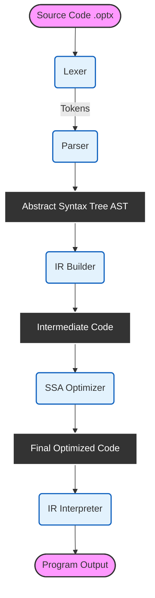
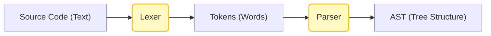
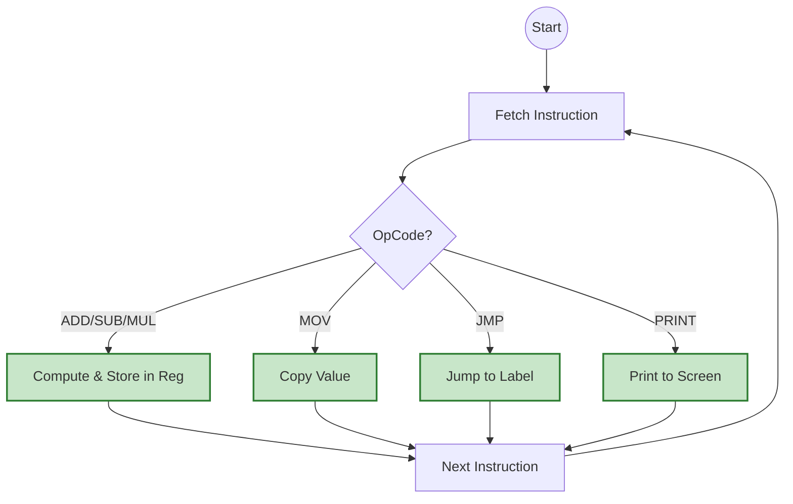
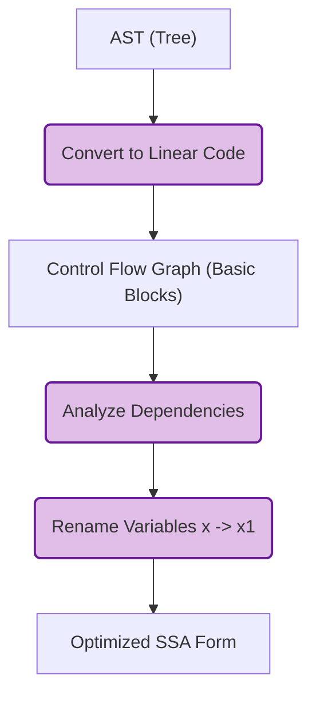

# Optimix Compiler: Project Architecture

## 1. Problem Statement
Many students learn Compiler Design using automated tools (like Flex and Bison), which hide the actual internal working of a compiler.

The **Main Problem** is to understand what actually happens inside a compiler.
**Solution**: To solve this, the **Optimix** project builds a compiler **completely from scratch** using C++.
It demonstrates:
1.  **Lexing & Parsing**: Reading code without external tools.
2.  **Simulation**: Running code directly (Interpreter).
3.  **Optimization**: Making code faster using advanced math (SSA Form).

---

## 2. Project Flowchart (Full System)
This diagram shows the complete journey of a source code file (`.optx`) inside the Optimix system.

---

## 3. Module Breakdown

### 3.1 Frontend (Reading the Code)
The frontend is the first part of the compiler. Its job is to read the text file and understand what it says.

*   **Lexer**: Reads characters (A, B, C...) and groups them into words called "Tokens" (like `if`, `while`, `x`, `10`).
*   **Parser**: Checks the grammar rules. For example, it ensures every `(` has a closing `)`. It builds a tree structure called the **AST**.

**Frontend Flowchart:**

---

### 3.2 Interpreter (Executing the Code)
The Interpreter now runs the **Optimized IR** instead of the raw AST. This means we execute the code after it has been improved.

*   **How it works**: It walks through the list of instructions (IR) linearly.
*   **Memory**: It simulates registers and memory for variables.
*   **Result**: It gives the output directly to the console.

**Interpreter Flowchart:**

---

### 3.3 Optimizer (Improving the Code)
This is the advanced part of the project. It transforms the code into a better version.

*   **IR Builder**: Converts the tree (AST) into a simple list of instructions (Linear Code). This is easier for computers to analyze.
*   **SSA (Static Single Assignment)**: This is a smart technique used by big compilers like GCC and LLVM. It renames variables so every variable is assigned only once (e.g., `x` becomes `x1`, `x2`). This helps to find and remove useless code.

**Optimization Flowchart:**

