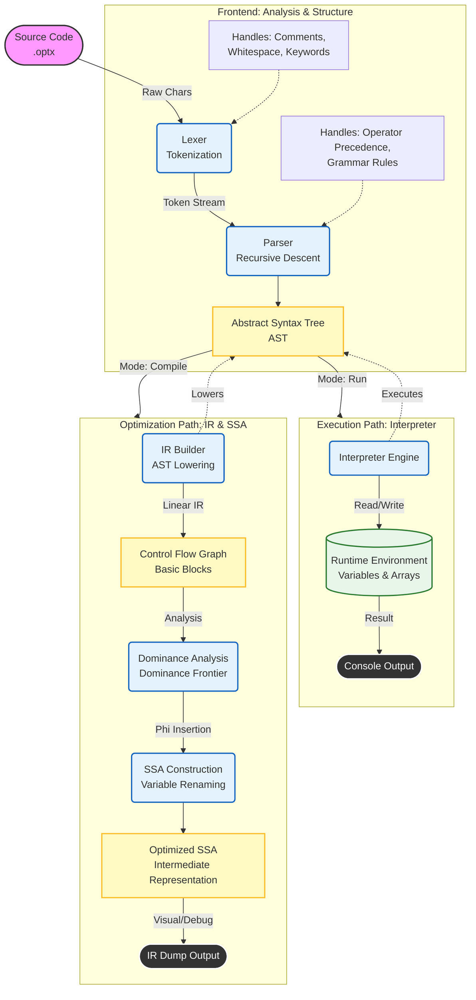

# Optimix Compiler Architecture

## 1. Problem Statement & Project Goal

### The Challenge
Building a modern compiler is often seen as a "black box" art. Many courses rely on heavy tools like Flex (lexing), Bison (parsing), or LLVM (backend), which hide the internal mechanics of how code actually runs. The challenge of **Optimix** was to build a fully functional programming language implementation **completely from scratch** in C++17, with zero external dependencies.

### The Objective
The goal of this project is to construct a **dual-mode language processor** that demonstrates two distinct ways of handling code:
1.  **Immediate Interpretation**: Executing the Abstract Syntax Tree (AST) directly for rapid feedback and debugging.
2.  **Advanced Compilation**: Lowering the AST into a custom **Linear Intermediate Representation (IR)**, constructing a **Control Flow Graph (CFG)**, and performing industrial-grade **Static Single Assignment (SSA)** optimization.

This capability highlights the bridge between high-level logic (structured control flow) and low-level machine logic (jumps, phi-functions, and flat instructions).

---

## 2. Detailed System Flowchart

The following flowchart illustrates the complete lifecycle of an `.optx` source file, showing how it branches into either direct execution (Interpreter) or compilation/optimization (IR Builder).

---

## 3. Deep Dive: Component Analysis

### 3.1 Frontend: From Text to Meaning
The frontend is responsible for understanding the structure of the code.

*   **Lexer (`src/lexer/Lexer.cpp`)**: 
    *   **Role**: The "scanner". It reads the raw file character by character.
    *   **Mechanism**: It groups characters into meaningful **Tokens** (e.g., `while`, `i`, `=`, `10`). It intelligently skips "noise" like comments (`//`) and whitespace.
    *   **Output**: A clean stream of tokens ready for parsing.

*   **Parser (`src/parser/Parser.cpp`)**:
    *   **Role**: The "architect". It ensures the tokens follow the grammatical rules of the language.
    *   **Mechanism**: Uses **Recursive Descent** for statements (handling nested blocks like `if` inside `while`) and **Operator Precedence Parsing** for expressions (ensuring multiplication `*` happens before addition `+`).
    *   **Output**: An **Abstract Syntax Tree (AST)**, a tree structure that represents the program's logic hierarchy.

### 3.2 Execution Path: The Interpreter
The interpreter (`src/codegen/Interpreter.cpp`) allows code to run immediately, similar to Python or Ruby.

*   **Mechanism**: It performs a depth-first traversal of the AST.
*   **State Management**: It maintains an **Environment** (a hash map) to store variable values (`int x = 5`).
*   **Safety**: It checks for runtime errors, such as accessing undeclared variables or out-of-bounds array indices, throwing exceptions to handle them gracefully.
*   **Memory**: Simulates both stack variables and heap-allocated arrays (`std::vector`).

### 3.3 Optimization Path: IR & SSA
This is the "industrial" side of the compiler (`src/ir/`), preparing code for advanced analysis.

*   **IR Builder (`src/ir/IRBuilder.cpp`)**:
    *   **Lowering**: Converts the hierarchical AST into a flat, sequential list of instructions called **Linear IR**.
    *   **3-Address Code**: Uses simple instructions like `t1 = a + b` where every operation has at most two inputs and one output.
    *   **Control Flow Graph (CFG)**: Breaks the detailed instructions into **Basic Blocks** (sequences of code without jumps) connected by branches. This represents loops and if-statements as a graph.

*   **SSA (Static Single Assignment) (`src/ir/SSA.cpp`)**:
    *   **Concept**: A property where every variable is assigned exactly once. `x = 1; x = 2;` becomes `x1 = 1; x2 = 2;`.
    *   **Dominance**: Computes the "Dominator Tree" to understand which blocks fundamentally control the execution of others.
    *   **Phi Functions**: Inserts special `phi` nodes at merge points (e.g., after an `if-else`) to reconcile different versions of a variable coming from different execution paths.
    *   **Benefit**: SSA form makes data-flow analysis (like determining if a variable is constant or unused) largely trivial and extremely fast.
