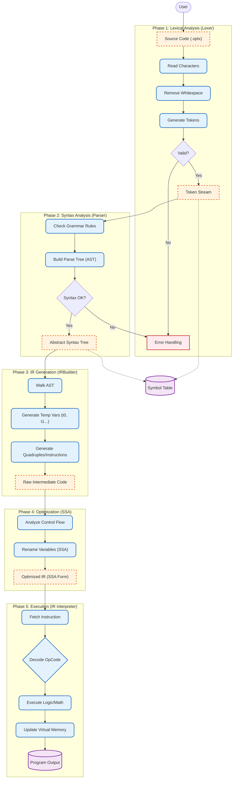

# Optimix Compiler: Project Architecture

## 1. Problem Statement
Many students learn Compiler Design using automated tools (like Flex and Bison), which hide the actual internal working of a compiler.

The **Main Problem** is to understand what actually happens inside a compiler.
**Solution**: To solve this, the **Optimix** project builds a compiler **completely from scratch** using C++.
It demonstrates:
1.  **Lexing & Parsing**: Reading code without external tools.
2.  **Simulation**: Running code directly (Interpreter).
3.  **Optimization**: Making code faster using advanced math (SSA Form).

---

## 2. Detailed System Flowchart
This diagram represents the complete lifecycle of a program in Optimix, inspired by standard compiler design phases.

---

## 3. Module Breakdown

### 3.1 Lexical Analysis (The Scanner)
*   **Goal**: specific reading of the source file.
*   **Actions**:
    *   Skips comments and whitespaces.
    *   Converts characters `i`, `n`, `t` into keyword token `int`.
    *   Converts `1`, `0`, `0` into number token `100`.
*   **Output**: A list of `Token` objects.

### 3.2 Syntax Analysis (The Parser)
*   **Goal**: Understanding the structure.
*   **Actions**:
    *   Ensures code follows the language grammar.
    *   Example: Checks that `if` is followed by `(...)` and then `{...}`.
    *   Constructs the **Abstract Syntax Tree (AST)**, which represents the code logic hierarchically.

### 3.3 IR Generation & Optimization
*   **Goal**: Simplifying and Improving.
*   **Actions**:
    *   **IR Builder**: Flattens the tree into a linear list of simple instructions (like Assembly).
    *   **SSA Optimizer**: Renames variables (`x` -> `x_1`, `x_2`) to make data flow explicit, simplifying further analysis.

### 3.4 Execution (The Virtual Machine)
*   **Goal**: Running the program.
*   **Actions**:
    *   The **IR Interpreter** acts as a virtual CPU.
    *   It fetches each IR instruction and performs the operation.
    *   It manages a virtual memory space for variables.

---
