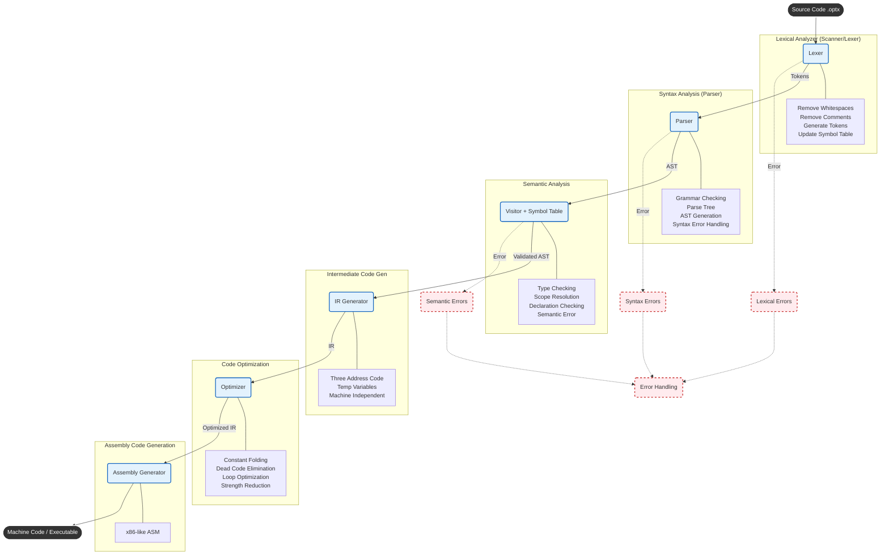

# Optimix Compiler: Detailed Architecture

## Project Overview
Optimix follows the standard compiler design pipeline, transforming high-level source code into executable instructions.

## Detailed Flowchart

This diagram illustrates the complete compilation process, from Source Code to Machine Code.

---

## Phase Breakdown

### 1. Lexical Analysis (Scanner)
*   **Input**: Source Code (Text)
*   **Tasks**:
    *   Scans code character by character.
    *   Removes whitespace and comments.
    *   Generates **Tokens** (Keywords, Identifiers, Operators).
    *   Updates the **Symbol Table**.
*   **Output**: Stream of Tokens.

### 2. Syntax Analysis (Parser)
*   **Input**: Tokens
*   **Tasks**:
    *   Checks against Grammar rules.
    *   Builds a **Parse Tree** or **Abstract Syntax Tree (AST)**.
    *   Handles Syntax Errors (e.g., missing semicolon).
*   **Output**: Abstract Syntax Tree (AST).

### 3. Semantic Analysis
*   **Input**: AST
*   **Tasks**:
    *   **Type Checking**: Ensures types match (e.g., `int + string` is invalid).
    *   **Scope Resolution**: Checks if variables are declared before use.
    *   **Declaration Checking**: Verifies function signatures.
*   **Output**: Validated / Annotated AST.

### 4. Intermediate Code Generation (ICG)
*   **Input**: Validated AST
*   **Tasks**:
    *   Converts AST to a linear sequence of instructions.
    *   Uses **Three Address Code** (e.g., `t1 = a + b`).
    *   Generates temporary variables.
    *   Keeps code **Machine Independent**.
*   **Output**: Intermediate Representation (IR).

### 5. Code Optimization
*   **Input**: IR
*   **Tasks**:
    *   **Constant Folding**: `3 + 5` -> `8`.
    *   **Dead Code Elimination**: Removes unused variables or unreachable code.
    *   **Loop Optimization**: Moves invariant code out of loops.
    *   **Strength Reduction**: Replaces expensive operations (multiply) with cheaper ones (shift).
*   **Output**: Optimized IR.

### 6. Assembly Code Generation
*   **Input**: Optimized IR
*   **Tasks**:
    *   Maps IR instructions to specific CPU instructions (e.g., x86 Assembly).
    *   Allocates registers.
*   **Output**: Assembly Code / Machine Code.
