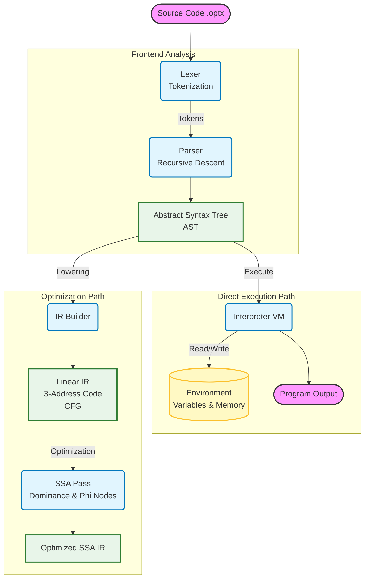

# Optimix Compiler Architecture

## Problem Statement
The Optimix project aims to build a high-performance, handcrafted compiler from scratch in C++17. The primary challenge is to implement a complete language processor that supports:
1.  **Complex Arithmetic & Logic**: Handling operator precedence and nested expressions.
2.  **Control Flow**: Supporting structured programming constructs like `while` loops and `if` statements.
3.  **Dual Execution Modes**: Providing both immediate interpretation for debugging and an intermediate representation (IR) optimized with Static Single Assignment (SSA) form for advanced analysis.
4.  **Zero Dependencies**: Achieving this without external parser generators (like Flex/Bison) or compiler frameworks (like LLVM), relying solely on the C++ Standard Library.

The goal is to demonstrate the internal mechanics of modern compilers, specifically how high-level code is transformed into a Linear IR, optimized using graph-theoretic algorithms (Dominance, SSA), and executed via a virtual machine.

## Project Flowchart

## detailed Flow Explanation

### 1. Source Processing (Frontend)
-   **Lexer (`src/lexer/Lexer.cpp`)**: Reads the raw source characters and groups them into `Tokens` (e.g., `IDENTIFIER`, `NUMBER`, `IF`, `WHILE`). It filters out whitespace and comments.
-   **Parser (`src/parser/Parser.cpp`)**: Consumes tokens to build an **Abstract Syntax Tree (AST)**. It uses **Operator Precedence Parsing** to correctly structure mathematical expressions (e.g., ensuring `*` has higher precedence than `+`) and Recursive Descent for statements.

### 2. Execution Path (Interpreter)
-   **Interpreter (`src/codegen/Interpreter.cpp`)**: This component directly executes the AST.
    -   It maintains an **Environment** map for variable storage (`x = 5`).
    -   It manages **Memory** for array simulations.
    -   This allows for immediate calculation of results without intermediate compilation steps, useful for testing and quick execution.

### 3. Optimization Path (IR & SSA)
-   **IR Builder (`src/ir/IRBuilder.cpp`)**: traverses the AST to generate a lower-level **Linear IR** (Intermediate Representation).
    -   It converts structured control flow (nested `if`/`while`) into a **Control Flow Graph (CFG)** of **Basic Blocks** connected by jumps (branches).
    -   It generates **3-Address Code** instructions (e.g., `t0 = a + b`).
-   **SSA Pass (`src/ir/SSA.cpp`)**: Performs advanced analysis on the IR.
    -   **Dominance Analysis**: Determines which blocks strictly precede others.
    -   **Phi Insertion**: Inserts `phi` functions at merge points in the CFG to handle variable versions coming from different paths.
    -   **Renaming**: Renames variables (e.g., `x` becomes `x_1`, `x_2`) to ensure every variable is assigned exactly once (Static Single Assignment), which simplifies further optimizations like constant propagation and dead code elimination.
